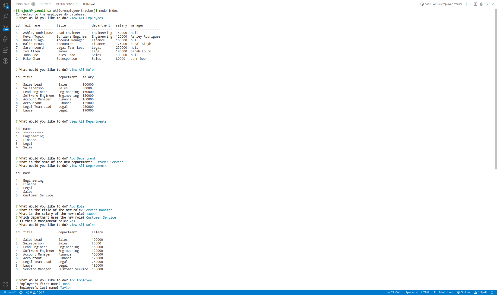

# wk12c-employee-tracker

## Description

This is a node application intended to be ran in the terminal only. It uses several node packages to manipulate a database from user selections. It also makes heavy use of async/await which presented a challenge throughout the project.

## Table of Contents (Optional)

- [Features](#features)
- [Installation](#installation)
- [Usage](#usage)
- [Credits](#credits)
- [License](#license)

## Features

- Display the tables for all employees, roles, and departments
- Add new employees, roles, and departments
- Update employee roles and managers

## Installation

Installation instructions of the terminal only node application below.

1. Run $ npm i to install all the required packages
2. Open mysql in terminal of package folder
3. Run $ source db/schema.sql;
4. Run $ source db/seeds.sql;

## Usage

Run the application by running 'node index' in the terminal. Follow the prompts for each menu selection to view, add, or update the tables in the database. Select 'Quit' in the menu to close the application menu.

Here is a video walkthrough: https://drive.google.com/file/d/1MQ-oJH8gpWuYLpWP3b9_VhFXuCglM9YV/view

## Credits

N/A

## License

Refer to the LICENSE in the repo.